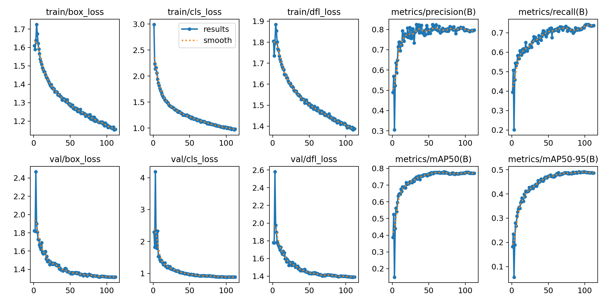
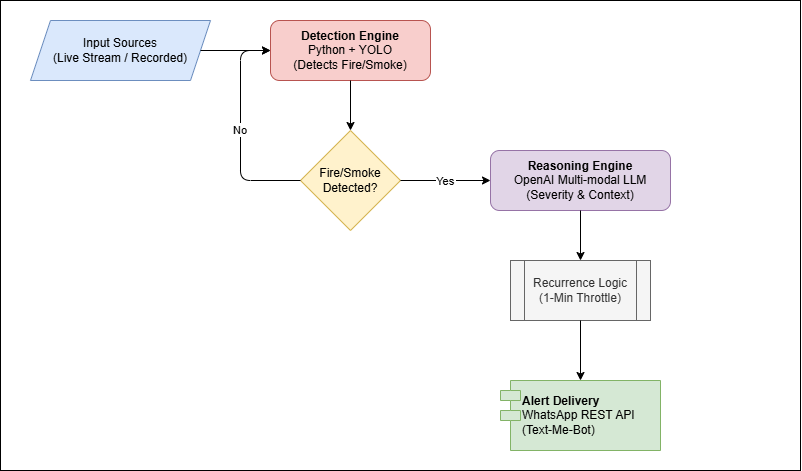

# Agentic Fire Detection System

# Table of Contents

1. [Problem Statement](#problem-statement)
2. [Overview](#overview)
3. [Dataset](#dataset)
5. [Training Summary](#training-summary)
6. [System Architecture](#system-architecture)
7. [Alert Structure](#alert-Structure)
<!-- 8. [Workflow](#workflow)
9. [Features](#features)
10. [Challenges & Limitations](#challenges--limitations)
11. [Future Enhancements](#future-enhancements)
12. [Conclusion](#conclusion)
13. [References](#references) -->

## Problem Statement:

Pakistan has widespread CCTV coverage across malls, shops, offices, and residential areas. While some facilities use smoke sensors and sprinkler systems, these mechanisms function independently and lack intelligent coordination. Surveillance systems record incidents, but they do not actively interpret or communicate emergencies in real time.

There is no unified system that can automatically detect fire or smoke, assess severity, and immediately notify firefighters with precise, actionable information. This disconnect between detection and response results in delayed intervention and increased risk to life and property.

## Overview

The **Agentic Fire Detection System** is an intelligent monitoring
solution designed to detect fire and smoke in real-time. By integrating
computer vision with multimodal Large Language Models (LLMs), the system
transitions from simple detection to sophisticated situational
awareness.

------------------------------------------------------------------------

## Dataset

The dataset consists of **10,463 annotated images**, available on [Roboflow](https://universe.roboflow.com/sayed-gamall/fire-smoke-detection-yolov11). This dataset is designed for training and evaluating **object detection models** tailored for real-time **fire and smoke detection**. It is suitable for:
* **Surveillance systems** (CCTV monitoring, smart security cameras)
* **Industrial safety applications** (factories, warehouses, refineries)
* **Residential safety solutions** (smart home fire detection)
* **Autonomous monitoring systems** (drones, robotics, IoT devices)

| Split      | Images | Annotations |
| ---------- | ------ | ----------- |
| Training   | 9,156  | 27,468      |
| Validation | 872    | 2,616       |
| Test       | 435    | 1,305       |

**Classes:** `Fire`, `Smoke`  
**Annotation Format:** YOLOv11-compatible bounding boxes

------------------------------------------------------------------------

## Training Summary

The model was trained using **YOLOv11** on a dataset of fire and smoke images. Training stopped early due to no improvement over 20 epochs, with the best results observed at **Epoch 92**.

### Training Graph

### Final Validation Results

| Metric        | Value     |
| ------------- | --------- |
| Precision (P) | **0.806** |
| Recall (R)    | **0.717** |
| mAP@50        | **0.770** |
| mAP@50-95     | **0.492** |

### Class-Specific Performance

| Class     | Precision | Recall | mAP@50 | mAP@50-95 |
| --------- | --------- | ------ | ------ | --------- |
| **Fire**  | 0.813     | 0.806  | 0.828  | 0.513     |
| **Smoke** | 0.800     | 0.629  | 0.711  | 0.472     |

## System Architecture

The workflow follows a structured pipeline from data ingestion to
emergency notification:

**Input Layer:**
The system accepts live streaming video or pre-recorded footage for
analysis.

**Detection Engine:**
A Python-based YOLO model serves as the primary filter, scanning frames
for specific fire/smoke signatures.

**Decision Logic:**
If fire or smoke is detected, the frame is passed to the Reasoning
Engine; otherwise, the system continues monitoring.

**Reasoning Engine:**
An OpenAI Multi-modal LLM analyzes the detected frame to provide
context, such as severity and surroundings.

**Alert Throttling:**
A recurrence logic is applied to ensure a **1-minute throttle** between
alerts to prevent notification fatigue.

**Alert Delivery:**
Finalized descriptive alerts are dispatched via the WhatsApp REST API.

------------------------------------------------------------------------

## Alert Structure

The system generates a comprehensive message consisting of two primary
data blocks:

### System Information

-   **Timestamp:** Date and time of the incident.
-   **Detection Frame:** The specific image frame where fire was
    identified.
-   **Location:** Pre-configured geographical or building data.

### AI-Generated Content

-   **Fire Severity:** An assessment of the threat level.
-   **Contextual Description:** Details regarding the area (e.g., shop,
    parking area) and an estimated count of people present in the frame.

------------------------------------------------------------------------